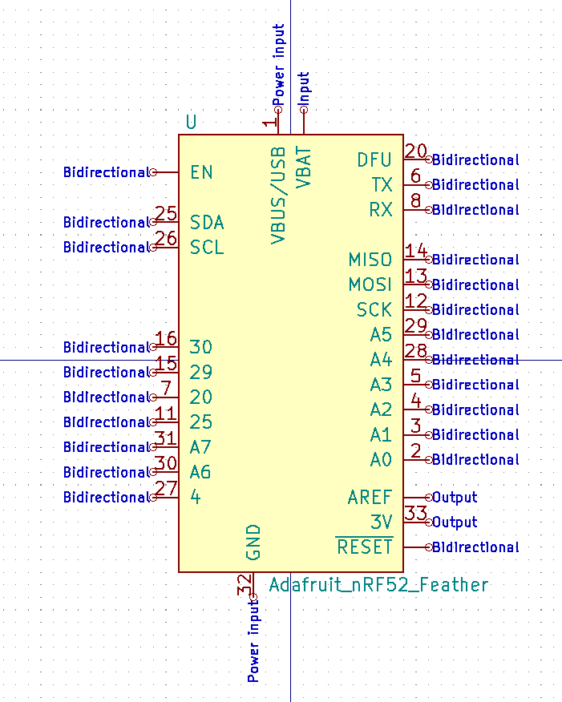
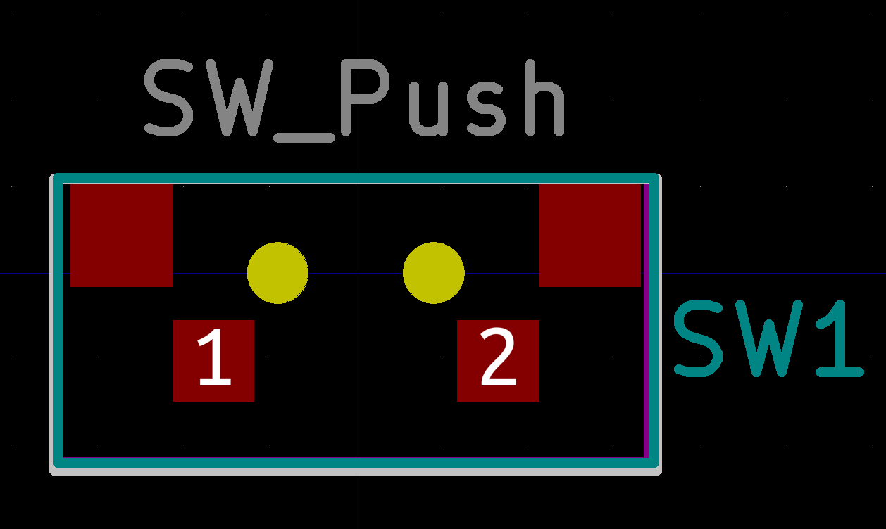
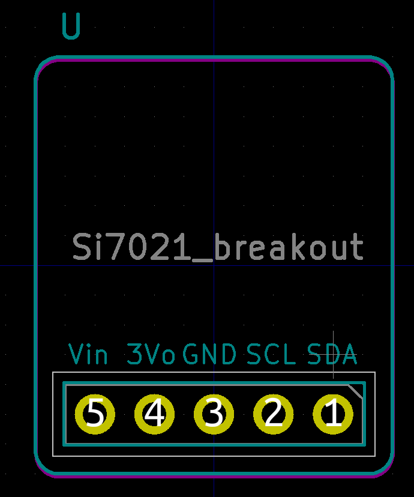
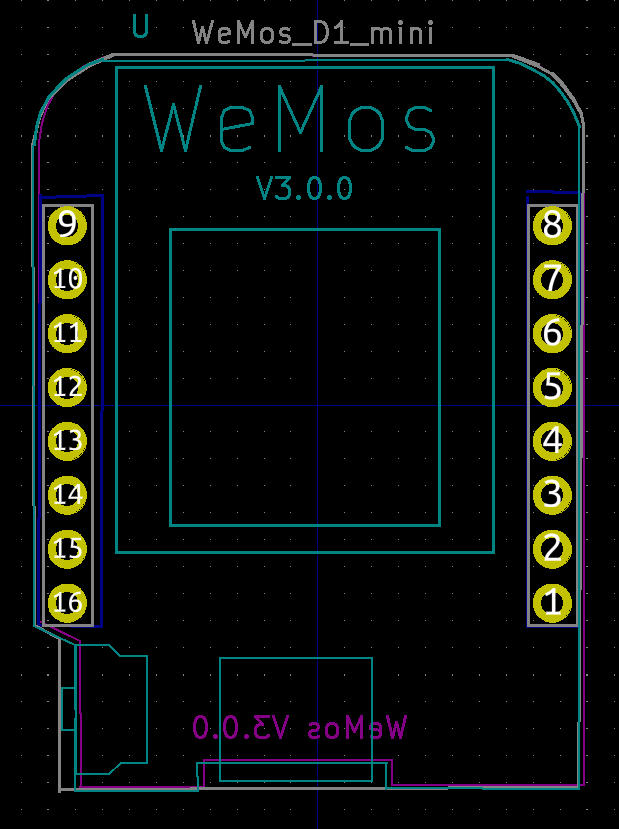
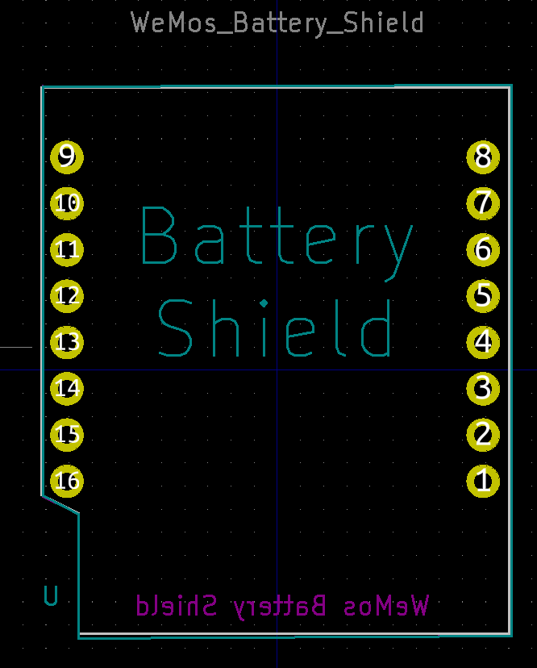
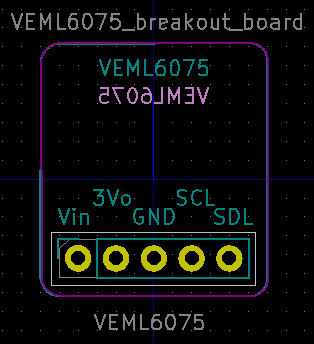
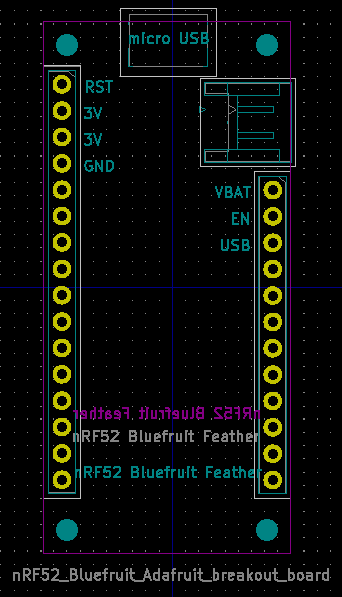
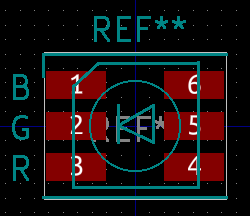
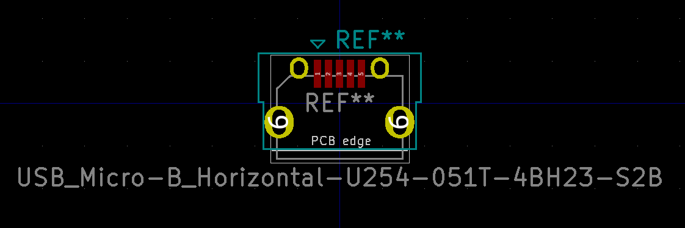
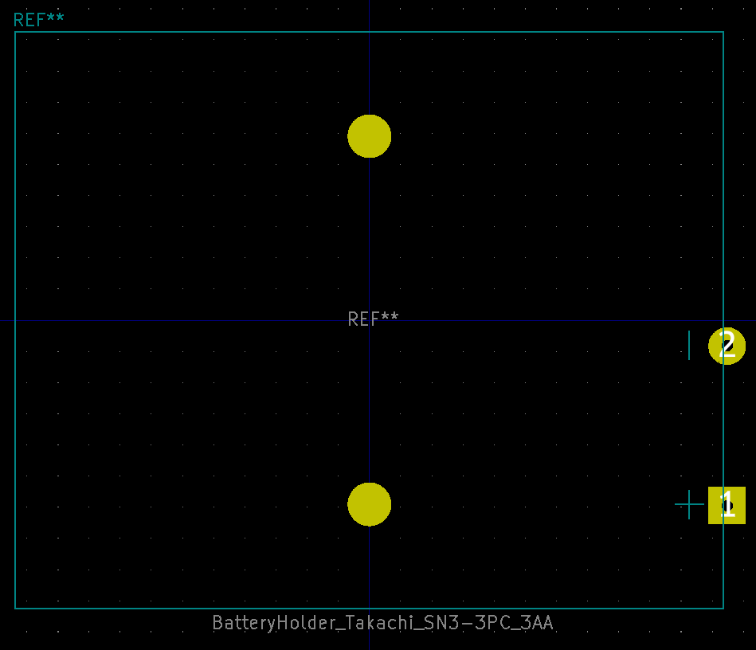

# kicad-library

This repository has common footprints and symbols used across projects. In each project, add this repository as a git submodule:

```sh
git add submodule https://github.com/hutscape/kicad-library.git hardware/library
```

<!-- START doctoc generated TOC please keep comment here to allow auto update -->
<!-- DON'T EDIT THIS SECTION, INSTEAD RE-RUN doctoc TO UPDATE -->
- [Symbols](#symbols)

- [Symbols](#symbols)
  - [Adafruit_nRF52_feather](#adafruit_nrf52_feather)
  - [Adafruit_sharp_display](#adafruit_sharp_display)
  - [Sensor_UV](#sensor_uv)
  - [Si7021_breakout_board](#si7021_breakout_board)
  - [wemos_battery_shield](#wemos_battery_shield)
  - [wemos_mini](#wemos_mini)
- [Footprints](#footprints)
  - [Push_Button](#push_button)
  - [Si7021](#si7021)
  - [wemos_d1_mini](#wemos_d1_mini)
  - [wemos_battery_shield](#wemos_battery_shield-1)
  - [VEML6075_breakout_board](#veml6075_breakout_board)
  - [nRF52 Bluefruit Feather Adafruit breakout board](#nrf52-bluefruit-feather-adafruit-breakout-board)
  - [CREE RGB LED 5.5mm x 5.5mm 6pin](#cree-rgb-led-55mm-x-55mm-6pin)
  - [Connector USB Micro-B Horizontal](#connector-usb-micro-b-horizontal)
  - [Battery holder for 3xAA Takachi](#battery-holder-for-3xaa-takachi)
  - [Passives 0805](#passives-0805)

<!-- END doctoc generated TOC please keep comment here to allow auto update -->

# Symbols

## Adafruit_nRF52_feather



## Adafruit_sharp_display


## Sensor_UV


## Si7021_breakout_board


## wemos_battery_shield


## wemos_mini


# Footprints

## Push_Button



## Si7021



## wemos_d1_mini



## wemos_battery_shield



## VEML6075_breakout_board



## nRF52 Bluefruit Feather Adafruit breakout board



## CREE RGB LED 5.5mm x 5.5mm 6pin



## Connector USB Micro-B Horizontal



## Battery holder for 3xAA Takachi



## Passives 0805

Capacitor


Diode


LED


Inductor


Resistor


