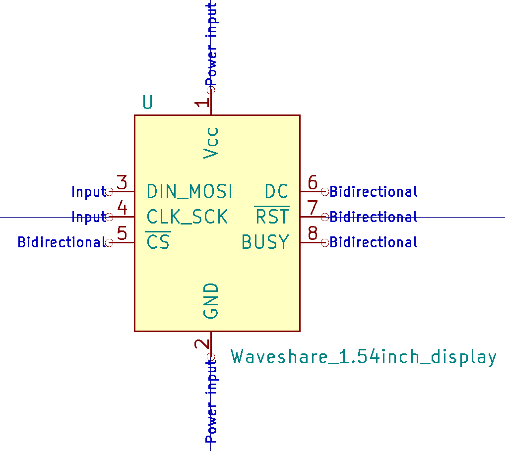

# Symbols

<!-- START doctoc generated TOC please keep comment here to allow auto update -->
<!-- DON'T EDIT THIS SECTION, INSTEAD RE-RUN doctoc TO UPDATE -->
- [Adafruit nRF52 feather](#adafruit-nrf52-feather)
- [Adafruit sharp display](#adafruit-sharp-display)
- [Sensor UV](#sensor-uv)
- [Si7021 breakout board](#si7021-breakout-board)
- [wemos battery shield](#wemos-battery-shield)
- [wemos mini](#wemos-mini)
- [Adafruit LoRaWAN RFM9x](#adafruit-lorawan-rfm9x)
- [GPS PA1010D](#gps-pa1010d)
- [Waveshare 1.54 inch e-ink display](#waveshare-154-inch-e-ink-display)

<!-- END doctoc generated TOC please keep comment here to allow auto update -->

## Adafruit nRF52 feather

## Adafruit sharp display

## Sensor UV

## Si7021 breakout board

## wemos battery shield

## wemos mini

## Adafruit LoRaWAN RFM9x

## GPS PA1010D

## Waveshare 1.54 inch e-ink display

