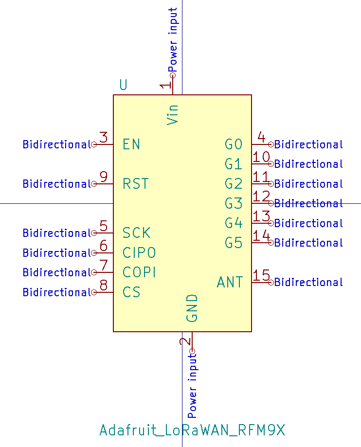
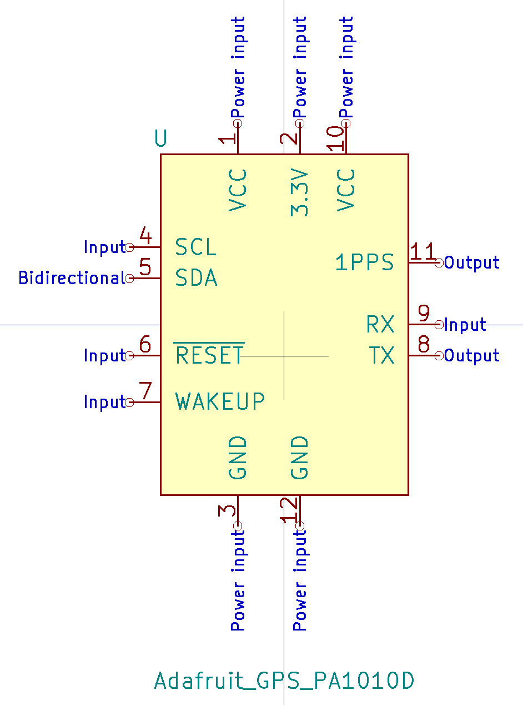
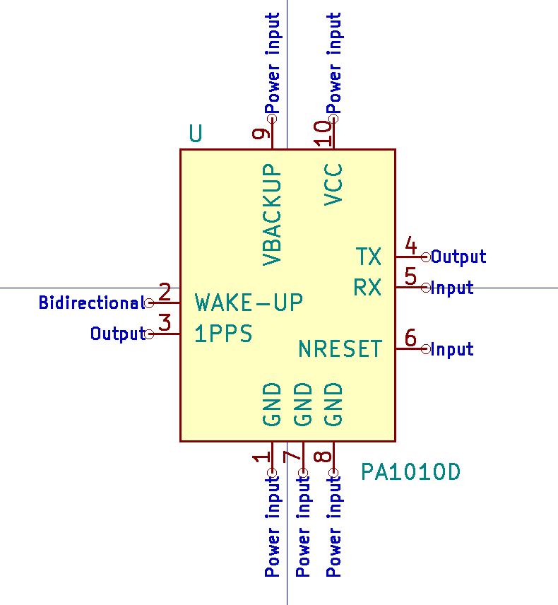
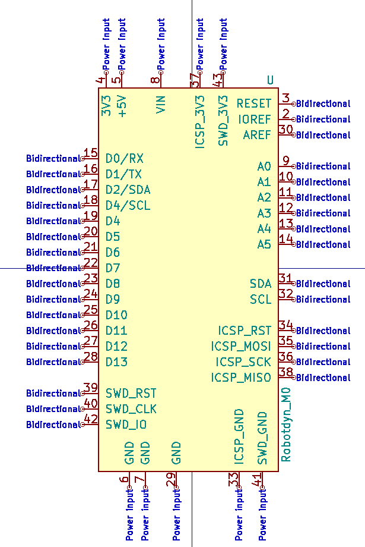
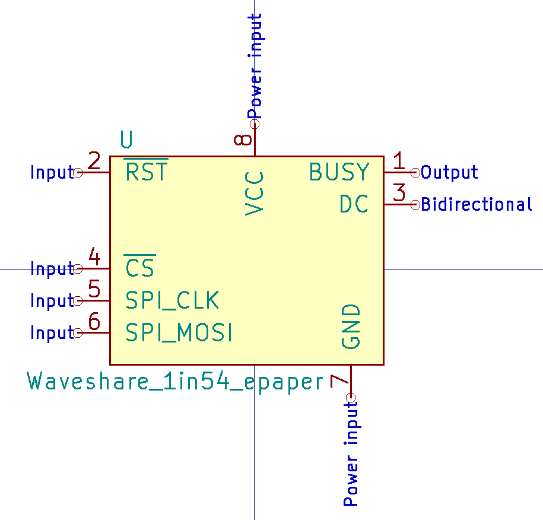

<!-- START doctoc generated TOC please keep comment here to allow auto update -->
<!-- DON'T EDIT THIS SECTION, INSTEAD RE-RUN doctoc TO UPDATE -->
**Table of Contents**

- [Adafruit_nRF52_feather](#adafruit_nrf52_feather)
- [Adafruit_sharp_display](#adafruit_sharp_display)
- [Adafruit RFM9x LoRaWAN](#adafruit-rfm9x-lorawan)
- [Adafruit PA1010D GPS](#adafruit-pa1010d-gps)
- [CDTop PA1010D GPS](#cdtop-pa1010d-gps)
- [Robotdyn SAMD21 M0 mini](#robotdyn-samd21-m0-mini)
- [SiLabs CP2102 USB to UART bridge](#silabs-cp2102-usb-to-uart-bridge)
- [SiLabs Si7021 breakout board](#silabs-si7021-breakout-board)
- [Vishay Sensor_UV](#vishay-sensor_uv)
- [Waveshare E-ink 1.54inch](#waveshare-e-ink-154inch)
- [WeMos ESP8266 battery shield](#wemos-esp8266-battery-shield)
- [WeMos D1 mini](#wemos-d1-mini)

<!-- END doctoc generated TOC please keep comment here to allow auto update -->

## Adafruit_nRF52_feather

## Adafruit_sharp_display

## Adafruit RFM9x LoRaWAN

## Adafruit PA1010D GPS

## CDTop PA1010D GPS

## Robotdyn SAMD21 M0 mini

## SiLabs CP2102 USB to UART bridge

## SiLabs Si7021 breakout board

## Vishay Sensor_UV

## Waveshare E-ink 1.54inch

## WeMos ESP8266 battery shield

## WeMos D1 mini

